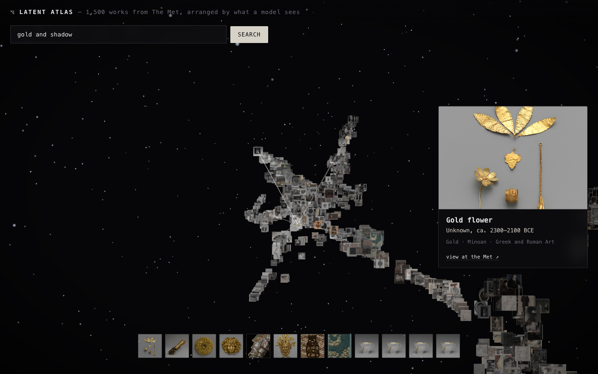

# Latent Atlas

**An explorable galaxy of a real museum collection — arranged not by date or department, but by what a neural network *sees*.**

Latent Atlas pulls thousands of artworks from The Metropolitan Museum of Art's Open Access
collection, embeds every image with **CLIP**, and lays them out in 3D so that visually and
conceptually similar works fall near each other. You fly through the result in the browser.
Then you type a phrase — *"storms at sea"*, *"gold and shadow"*, *"a quiet interior"* — and a
CLIP text encoder running **live in your browser** flies the camera to the works that match,
by meaning, across the whole collection. No tags, no keywords, no search index.



---

## Why it works the way it does

CLIP maps images and text into the *same* 512-dimensional space. The data pipeline embeds
every artwork's **image**; the browser embeds your **text** at query time. Because they live
in one space, a dot product between your phrase and every artwork *is* a semantic search —
cross-modal, and computed entirely on the client. The 3D layout is a UMAP projection of those
same image vectors, so the galaxy you're flying through and the search that moves you are two
views of one embedding.

## Stack

| Concern | Tech |
| --- | --- |
| 3D rendering | **Three.js WebGPU renderer + TSL** (Three Shading Language), with automatic WebGL2 fallback |
| In-browser ML | **transformers.js** running CLIP's text encoder on **WebGPU** (WASM fallback) |
| Data pipeline | **TypeScript / Node** — fetch → CLIP image embeddings → UMAP → texture atlas |
| Backend | **Fastify** service exposing the same semantic search as a JSON API |
| Build | **Vite** |
| Imagery | The Met Open Access API + IIIF image CDN |

Every artwork is rendered as an instanced, camera-facing sprite sampled from a single packed
texture atlas; match scores and atlas cells are driven per-instance inside a TSL node material,
so highlighting and dimming during search happen on the GPU. A WebGPU post chain adds a bloom
pass (matched works glow during a search) and a vignette.

## What you can do

- **Search by meaning** — type a phrase; CLIP's text encoder runs in your browser and the camera flies to the matches.
- **More like this** — click any work to highlight its nearest neighbours by image-embedding similarity (no model call — it reuses the precomputed vectors).
- **Inspect** — hover for a live detail card pulled from the Met; a selection ring marks the work under your cursor.
- **Top-matches strip, suggested-query chips, Esc to reset**, and a gentle idle auto-rotate.

## Run it

```bash
npm install

# 1. build the dataset (fetches from the Met, embeds with CLIP, projects with UMAP)
npm run atlas            # N=1500 by default; override with `N=3000 npm run atlas`

# 2a. explore (front end only)
npm run dev              # → http://localhost:5173

# 2b. or run the full-stack version (built app + semantic search API)
npm run build
npm run server           # → http://localhost:8080/ai-prototypes/latent-atlas/
#   try: curl 'http://localhost:8080/api/nearest?q=storms+at+sea'
```

Before publishing or opening a pull request, run the full release check:

```bash
npm run check
```

## Deploy

The included GitHub Actions workflow publishes the static build to GitHub Pages.
It assumes this project is deployed as `ai-prototypes/latent-atlas`, matching the
configured Vite base path. Enable **Settings → Pages → GitHub Actions** in the
repository once, then push to `main`.

The pipeline writes three files to `public/data/`:

- `atlas.json` — metadata + 3D positions + atlas cell per artwork
- `embeddings.bin` — `Float32 [N × 512]`, L2-normalised, for cosine search
- `atlas.png` — the packed thumbnail texture atlas

## Notes & honesty

- The whole experience runs client-side; the Fastify server is included to show the
  same model serving a typed JSON API (the full-stack shape), not because the UI needs it.
- Embeddings are computed from each work's `primaryImageSmall` thumbnail, so clustering
  reflects composition and palette as much as subject — which is part of what makes the
  map interesting to wander.
- Met image rights vary; this project links back to each object's page at metmuseum.org.

## What I'd build next

- GPU-side k-NN so the search highlight resolves without the CPU cosine pass
- Gesture navigation via **MediaPipe Hands** (fly by moving your hand)
- A daily refresh that grows the collection over time
- Deep-linkable views (share a query or a work as a URL)

---

Built by Siddharth Mehta. Data courtesy of The Metropolitan Museum of Art under its
[Open Access](https://www.metmuseum.org/about-the-met/policies-and-documents/open-access) program.
